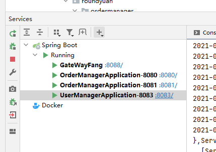
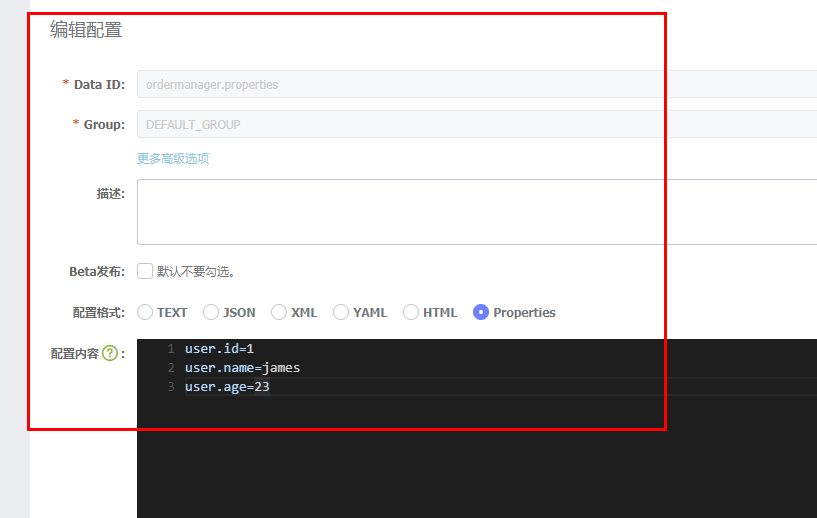
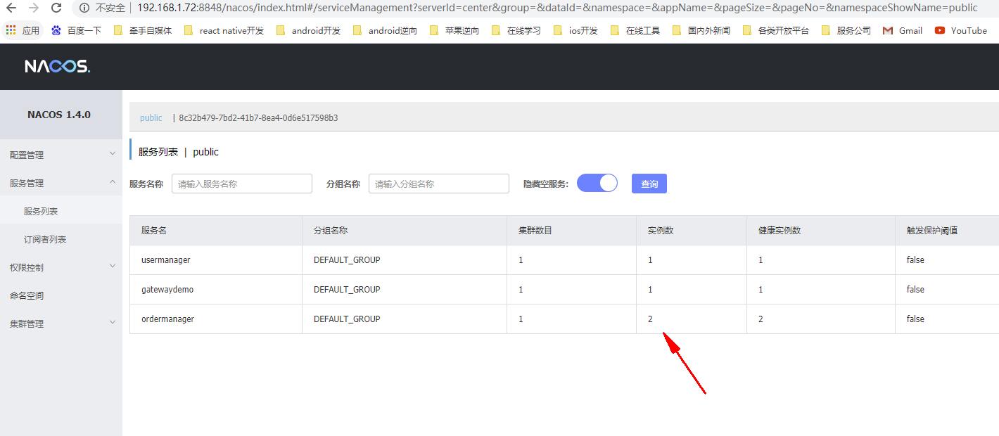
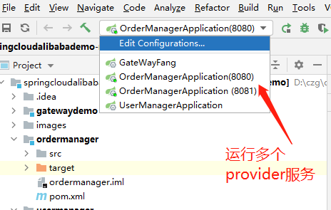

#基础工程
https://github.com/RoundYuanYuan/springcloudalibabademo
#idea中运行各个模块即实例

# nacos中配置的信息
1.

你也可以在nacos中导入配置nacos_config_export_20210428163222.zip

2. 运行时nacos 服务运行在 192.168.1.72：8846、8847、8848
---
3. nacos最终看到的服务列表
   

#ordermanager说明
1. 服务提供者provider；
2. 正常访问（数据配置在nacos服务中） http://localhost:8080/user；
3. 通过Edit Configurations运行多个服务实例

#usermanager说明
1. 服务消费者者comsumer，其他usermanager也是一个服务提供者provider；
2. http://localhost:8083/getConfig
3. 通过Feign调用在nacos中注册的ordermanager服务中的/user,具体查看OrderManager接口 
4. 随机在多个订单管理实例调用 http://localhost:8080/user

   

